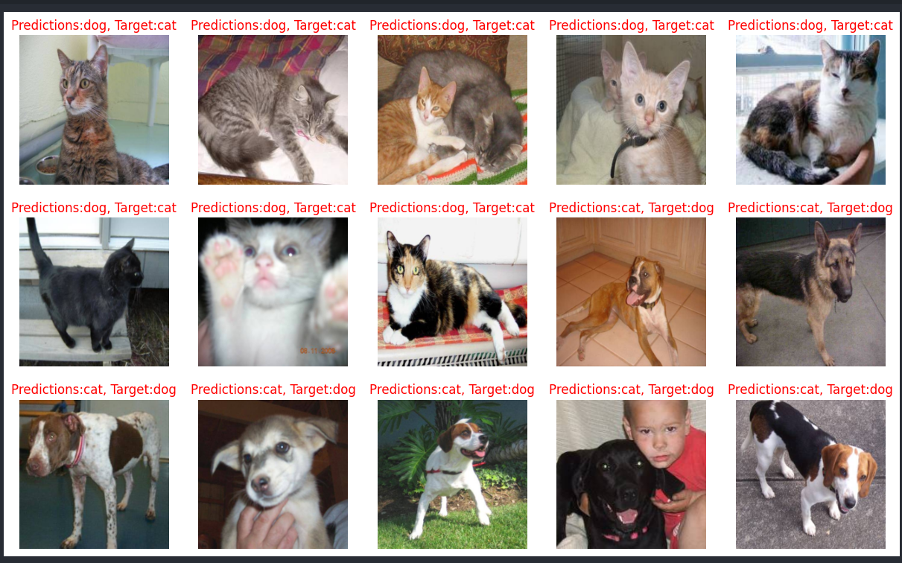

# Data Understanding & Pipeline Check

## Overview
This project focuses on understanding the dataset and verifying the training pipeline before training a full-scale deep learning model. The structured approach ensures that each step in the data pipeline is validated before committing resources to extensive training.


## Steps for Training a Neural Network
The training process consists of the following steps:

### Step 1 - Understand Your Problem
- Define the classification or regression task.
- Identify the features and target variables.

### Step 2A - Get the Data
- Acquire the dataset from reliable sources.
- Ensure data quality and completeness.

### Step 2B - Explore & Understand Your Data
- Visualize sample data points.
- Analyze data distributions and feature importance.

### Step 2C - Create a Sample Dataset
- Extract a small subset of the dataset.
- Use it for quick validation and debugging before full-scale training.

### Step 3 - Data Preparation
- Perform data augmentation (if applicable).
- Normalize, clean, and preprocess the data.
- Split data into training, validation, and test sets.

### Step 4 - Train a Simple Model on Sample Data
- Build a basic neural network.
- Train on the sample dataset.
- Validate the training pipeline before moving to the full dataset.

### Step 5 - Train on Full Data
- Train the model using the entire dataset.
- Monitor loss, accuracy, and other performance metrics.

### Step 6 - Improve Your Model
- Tune hyperparameters.
- Experiment with deeper architectures or transfer learning.
- Implement regularization techniques such as dropout and batch normalization.

## Prerequisites
- Python 3.x
- TensorFlow or PyTorch
- NumPy, Pandas, Matplotlib
- OpenCV (if image data is involved)

## Installation
Run the following command to install the required dependencies:

```bash
pip install tensorflow torch numpy pandas matplotlib opencv-python
```

## Running the Training Pipeline
1. Download and preprocess the dataset.
2. Train a simple model on a small subset to verify the pipeline.
3. Train a deep learning model on the full dataset.
4. Evaluate the model and fine-tune as necessary.
5. Analyze the results and document findings.


## runing project with Jupyter Notebook
data-understanding-pipeline-check-vk-ipynb


## Acknowledgments
- Inspired by best practices in deep learning training.
- Thanks to open-source contributors for tools and frameworks used in this project.


